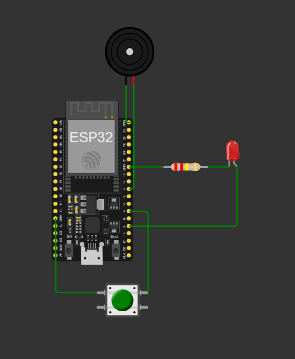

# Pomodoro IoT – Futuro do Trabalho com ESP32 e ThingSpeak

## Imagem do circuito

  

## Link do projeto no Wokwi

[Projeto no Wokwi](https://wokwi.com/projects/447641177141234689)

## 1. Descrição Geral

Este projeto implementa um temporizador **Pomodoro IoT** utilizando um **ESP32**, simulado no **Wokwi**, para apoiar o bem-estar e a produtividade de trabalhadores em ambientes digitais e remotos. Ambiente este que é cada vez mais comum com a nova onda de automação surgindo. O método Pomodoro é muito utilizado por estudantes e pessoas que trabalham de forma remota por ajudar no manejo da disciplina e produtividade.

O sistema alterna automaticamente entre períodos de foco e pausa, sinalizando o estado atual por meio de **LED** e **buzzer**, e envia os dados de cada ciclo para a nuvem usando comunicação **HTTP** com o serviço **ThingSpeak**.

## 2. Problema

Com o aumento do trabalho remoto e híbrido, muitos profissionais passam longos períodos em frente ao computador sem pausas adequadas. Isso gera:

- Cansaço extremo e estresse;
- Queda de produtividade;
- Problemas de saúde (postura, visão, fadiga mental);
- Dificuldade de manter uma rotina saudável de trabalho.

Apesar de existirem técnicas como o método Pomodoro, na prática as pessoas esquecem de ativar timers ou ignoram alarmes do próprio computador/celular.

---

## 3. Solução Proposta

A solução proposta é um **dispositivo físico IoT** baseado em ESP32 que:

1. **Implementa automaticamente o ciclo Pomodoro**
   - 4 ciclos de foco e pausa curta;
   - Seguidos de uma pausa longa;
   - Repetição contínua até o usuário parar.

2. **Oferece interação simples**
   - Um botão inicia ou interrompe completamente o ciclo;
   - Um LED indica o estado:
     - Aceso fixo → foco  
     - Piscando rápido → pausa curta  
     - Piscando devagar → pausa longa  
     - Apagado → inativo  
   - Um buzzer emite bipes diferentes para:
     - Início de foco  
     - Início de pausa curta  
     - Início de pausa longa  

3. **Envia dados para a nuvem (ThingSpeak) via HTTP**
   - A cada mudança de estado, o ESP32 faz uma requisição HTTP ao ThingSpeak;
   - São enviados:
     - `field1` → Estado atual (0 = Idle, 1 = Foco, 2 = Pausa Curta, 3 = Pausa Longa)  
     - `field2` → Número do ciclo (1 a 4)  
   - Isso permite monitorar o andamento do trabalho em um dashboard online, integrando o dispositivo ao ecossistema de IoT.

Os tempos foram reduzidos para **simulação**:

- 25 segundos de foco  
- 5 segundos de pausa curta  
- 25 segundos de pausa longa  

Na aplicação real, esses valores podem ser ajustados para **25 minutos** e **5 minutos**.

---

## 4. Funcionalidades

- Início e parada do Pomodoro por botão físico;
- Ciclos automáticos de:  
  **25s foco → 5s pausa → (4x) → 25s pausa longa → repete**;
- Indicação visual do estado por LED;
- Alertas sonoros nas transições de estado;
- Envio de dados para ThingSpeak utilizando HTTP;
- Organização da lógica em máquina de estados (`IDLE`, `WORK`, `BREAK_`, `LONG_BREAK_`).

---

## 5. Arquitetura do Sistema

### 5.1. Hardware (simulado no Wokwi)

- ESP32 Dev Module  
- LED + resistor (cerca de 220–330 Ω)  
- Pushbutton (botão momentâneo)  
- Piezo buzzer  

**Conexões principais:**

- LED → GPIO 2 (com resistor em série para GND)  
- Botão → GPIO 4 e GND (usando `INPUT_PULLUP`)  
- Buzzer → GPIO 5 (+) e GND (–)  

### 5.2. Software / Lógica

- Código em C/C++ usando framework Arduino para ESP32;
- Uso de `millis()` para controle de tempo sem travar o loop;
- Máquina de estados para gerenciar:
  - `IDLE` – parado  
  - `WORK` – foco  
  - `BREAK_` – pausa curta  
  - `LONG_BREAK_` – pausa longa  
- Função dedicada para mudar de estado (`changeMode`) e enviar o novo estado ao ThingSpeak;
- Função `beep()` para padronizar os alertas sonoros.

### 5.3. Comunicação HTTP com ThingSpeak

- Conexão Wi-Fi (no Wokwi):
  - SSID: `Wokwi-GUEST`  
  - Senha: vazia  
- Requisições HTTP do tipo **GET** para a URL:  
  `http://api.thingspeak.com/update`
- Parâmetros enviados:
  - `api_key` → chave de escrita do canal  
  - `field1` → código do estado  
  - `field2` → ciclo atual  

---

## 6. Dependências

### 6.1. Hardware / Ambiente

- Conta no **ThingSpeak** (gratuita) e um canal criado com:
  - Field 1 = Estado  
  - Field 2 = Ciclo  
- Simulador **Wokwi** (projeto configurado para ESP32 com internet ativada).

### 6.2. Bibliotecas (Arduino / ESP32)

As seguintes bibliotecas são utilizadas no código:

- `WiFi.h` – Gerenciamento da conexão Wi-Fi do ESP32  
- `HTTPClient.h` – Envio de requisições HTTP (GET) para o ThingSpeak  
- É necessário instalar o **core do ESP32** na Arduino IDE, caso o projeto seja executado localmente.
